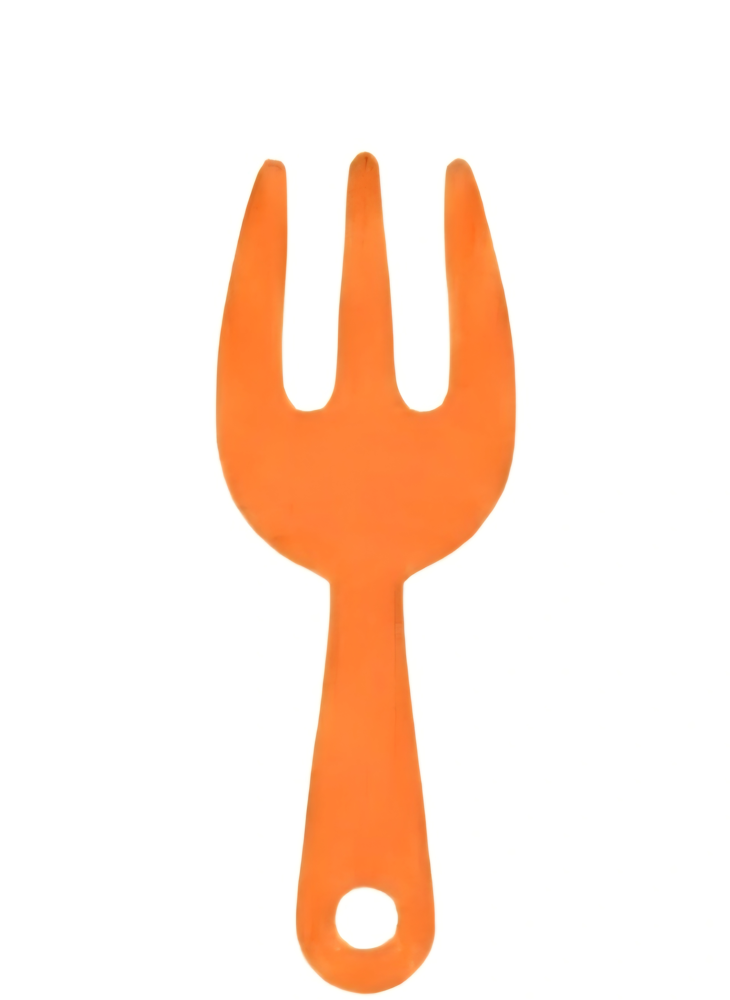
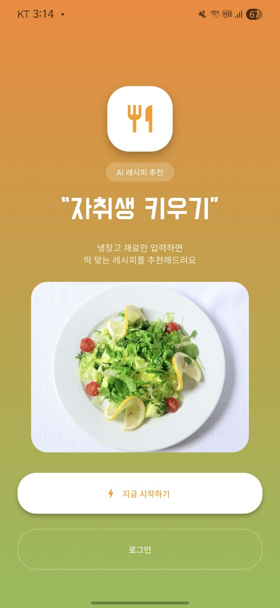
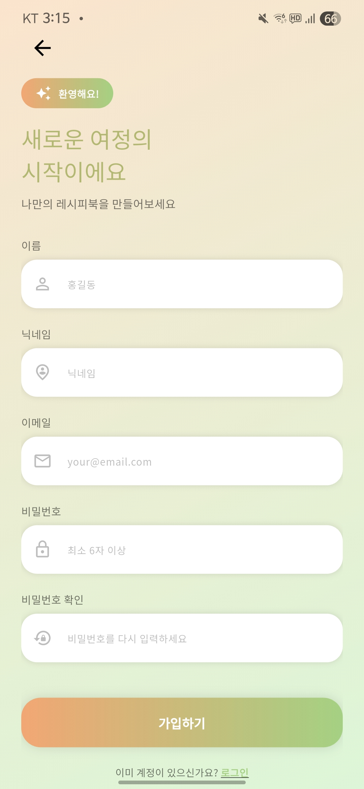
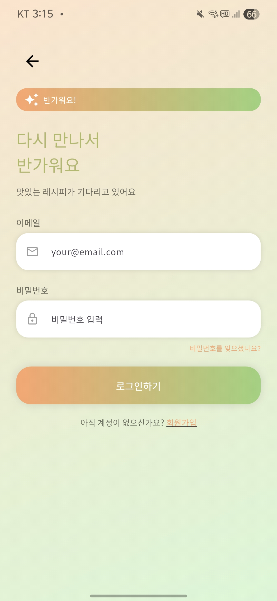
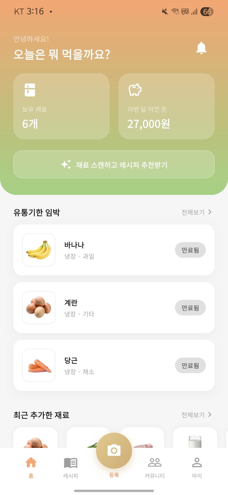
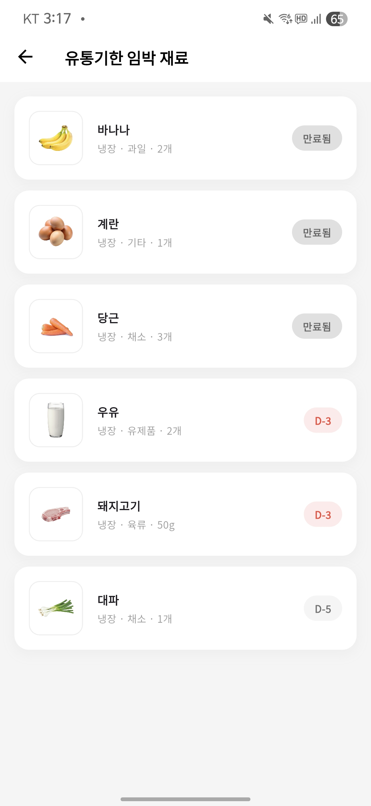
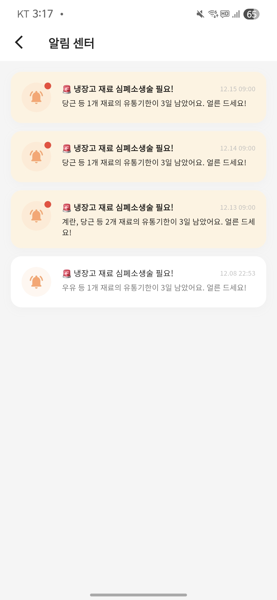
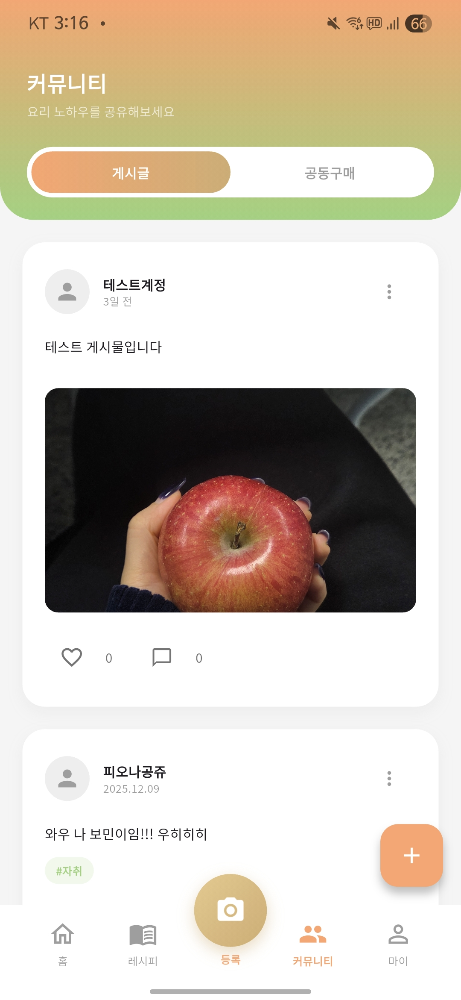
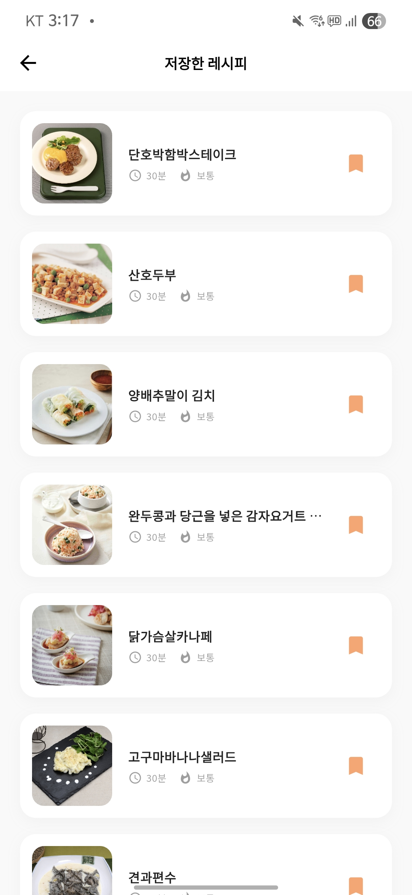
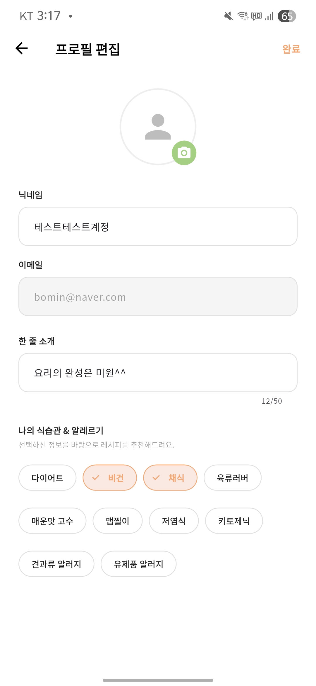

#  자취생 키우기 (Living Alone Care)
자취생 키우기는 AI 이미지 인식 기술을 통해 번거로운 식재료 등록 과정을 자동화하고, 현재 보유한 재료에 최적화된 레시피를 제안함으로써 음식물 쓰레기 감소와 식비 절감을 동시에 실현하는 서비스입니다.

## 📖 프로젝트 개요 (Project Overview)

자취생 키우기는 1인 가구의 가장 큰 고민인 **식재료 낭비**와 **메뉴 선정의 어려움**을 해결하기 위해 개발된 모바일 애플리케이션입니다.

AI 이미지 인식 기술을 활용해 식재료를 자동 등록하고 사용자가 보유한 재료를 기반으로 맞춤형 레시피를 추천함으로써 효율적인 식재료 관리와 합리적인 소비를 돕는 것을 목표로 합니다.

개발 기간: 2024.09 ~ 2024.12

팀명: 보송이 (3인 팀)

## 🛠️ 기술 스택 (Tech Stack)

### Frontend
 

### Backend & Database (Serverless)
   

### Authentication & Messaging
 

### AI & External APIs
  

## ✨ 주요 기능 (Key Features)

### 0. 🔒 회원가입 및 로그인

  


### 1. 📸 AI 식재료 등록

스마트폰 카메라로 식재료를 촬영하면 **AI(Vision API)** 가 객체를 인식합니다.

영문 인식 결과(예: Onion)를 자동 번역 API를 통해 한글(양파)로 변환하여 입력 폼에 채워줍니다.

'Plastic bottle' 같은 용기 키워드를 필터링하여 내용물만 정확히 인식합니다.

 

### 2. 🧊 스마트 냉장고 재고 관리

'나의 냉장고' 탭에서 보유 재료를 한눈에 확인합니다.

유통기한 임박(D-3) 재료를 빨간색 태그로 경고하고 상단에 노출합니다.

FCM 푸시 알림을 통해 앱을 켜지 않아도 유통기한 임박 사실을 알려줍니다.

  


### 3. 🍽️ 맞춤형 레시피 추천

"냉장고에 있는 걸로 뭐 해 먹지?" 고민 해결!

내 재고와 레시피 DB를 실시간 대조하여 **매칭률(%)** 이 높은 순서대로 요리를 추천합니다.

부족한 재료가 무엇인지 직관적으로 보여주어 장보기를 유도합니다.

 

### 4. 🏘️ 커뮤니티 & 마이페이지

1인 가구 간 꿀팁 공유 및 소통 공간 제공.
개인별 절약 금액 통계 및 앱 설정 관리.

  

<br/>

## ⚙️ 시스템 아키텍처 (Architecture)


### AI Pipeline (식재료 인식 흐름)
- 사용자가 앱에서 식재료를 촬영하면 이미지가 **Cloud Functions**의 서버리스 함수(`analyzeImage`)로 전송됩니다.
- 서버리스 함수는 **Google Cloud Vision API**를 호출하여 식재료를 인식합니다.
- 정제된 식재료 정보는 **Cloud Firestore**에 저장되어 재고 데이터로 관리됩니다.
- 촬영된 이미지는 **Cloud Storage**에 저장되어 데이터 관리 및 추후 활용이 가능합니다.

### Real-time Sync (실시간 데이터 동기화)
- 식재료 및 레시피 데이터는 **Cloud Firestore**를 통해 관리됩니다.
- Firestore의 실시간 스트림(Stream) 기능을 활용하여 데이터 변경 사항이 즉시 앱 화면에 반영됩니다.
- 별도의 새로고침 없이도 재고 상태 및 추천 레시피가 실시간으로 업데이트됩니다.

### Automation & Notification (자동화 및 알림)
- **Cloud Scheduler**가 매일 정해진 시간에 실행되어 유통기한을 자동으로 검사합니다.
- 유통기한이 임박한 식재료가 있을 경우 **Firebase Cloud Functions**가 이를 감지합니다.
- **Firebase Cloud Messaging(FCM)** 을 통해 사용자에게 유통기한 알림 푸시 메시지를 전송합니다.

### Authentication (인증)
- 사용자 인증은 **Firebase Authentication**을 통해 처리됩니다.
- 로그인된 사용자 기준으로 개인별 식재료, 레시피, 커뮤니티 데이터가 분리되어 관리됩니다.


> 본 구조는 서버 관리 부담을 최소화하면서도  
> 확장성과 실시간성을 동시에 확보할 수 있는 **Serverless Architecture**를 기반으로 설계되었습니다.

<br/>

## 🚀 설치 및 실행 방법 (Installation & Setup)

이 프로젝트는 **Flutter** 환경에서 실행됩니다. 아래 단계를 따라 프로젝트를 설정하고 실행해 주세요.

### 1. 환경 설정 (Prerequisites)
이 프로젝트를 실행하기 위해 다음 도구들이 필요합니다.
* **Flutter SDK**: 3.0.0 이상 ([설치 가이드](https://docs.flutter.dev/get-started/install))
* **IDE**: Android Studio 또는 VS Code (Flutter/Dart 플러그인 설치 필요)

### 2. 프로젝트 클론 (Clone)
터미널을 열고 프로젝트를 로컬 환경으로 복제합니다.

```
git clone https://github.com/nyeonggyeong/LivingAloneCare_App.git
cd living-alone-care
```
### 3. 패키지 설치

```
flutter pub get 
```
### 4. Firebase 설정
본인의 Firebase 프로젝트에서 google-services.json 파일을 다운로드하여 android/app/ 경로에 배치해야 합니다. pubspec.yaml 및 functions/ 폴더 내의 API 키 설정이 필요할 수 있습니다. 

### 5. 앱 실행
```
flutter run
```

## 🎥 데모 영상 (Demo Video)
